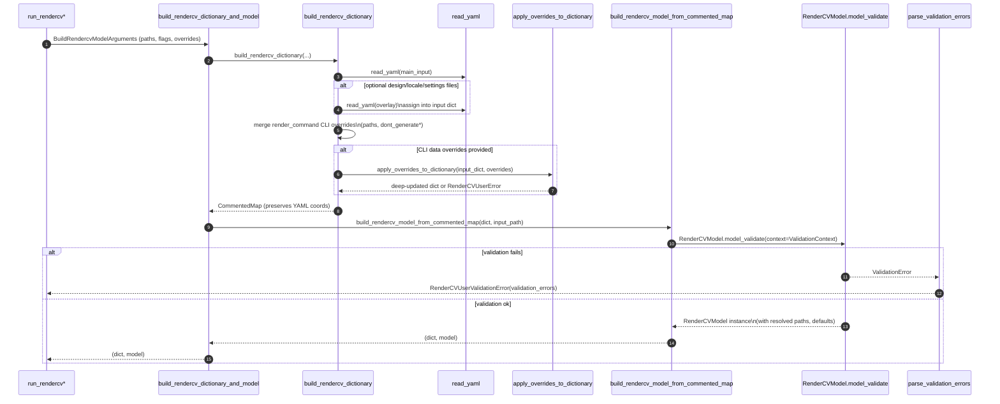
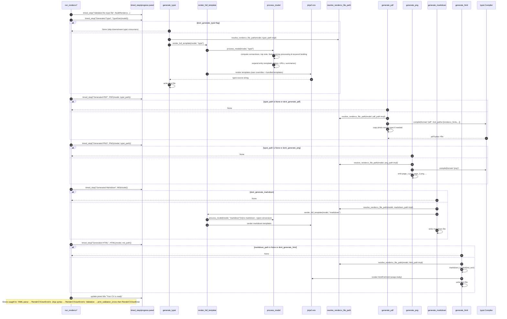
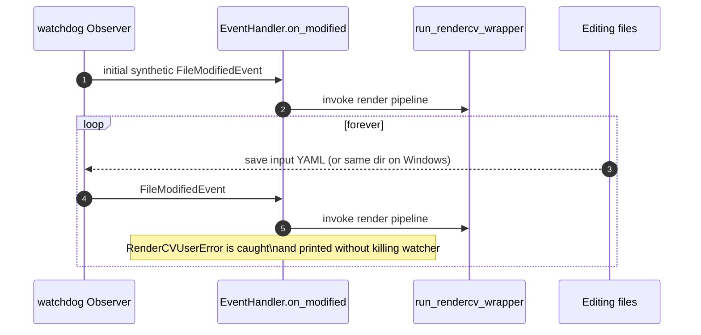

# RenderCV Workflow (Sequence Diagrams)

This file sketches the control flow through the render pipeline so newcomers can quickly see how the CLI, validation, and renderers cooperate.

## CLI Entry and Dispatch (`rendercv render`)

```mermaid
sequenceDiagram
    autonumber
    participant U as User
    participant CLI as Typer app (`rendercv`)
    participant Decorator as handle_user_errors
    participant Cmd as cli_command_render
    participant Overrides as parse_override_arguments
    participant Watcher as run_function_if_file_changes
    participant Runner as run_rendercv_wrapper

    U->>CLI: rendercv render <input> [options]
    CLI->>Decorator: dispatch render command
    Decorator->>Cmd: call
    Cmd->>Overrides: parse extra --foo.bar "value"
    Overrides-->>Cmd: overrides dict | RenderCVUserError on shape issues
    Cmd->>Cmd: assemble BuildRendercvModelArguments\n(paths, dont_generate flags, overrides)
    Cmd->>Runner: define wrapper -> run_rendercv / run_rendercv_quietly
    alt --watch provided
        Cmd->>Watcher: run_function_if_file_changes(input_path, Runner)
        Watcher->>Runner: initial call
        loop on file change
            Files-->>Watcher: watchdog FileModifiedEvent
            Watcher->>Runner: re-run render pipeline
        end
    else
        Cmd->>Runner: execute once
    end
    Runner-->>Decorator: propagate success or RenderCVUserError
    Decorator->>U: print message on error, exit 1
```

Key notes:
- `run_rendercv` shows a live progress panel; `run_rendercv_quietly` skips the UI but follows the same steps.
- The decorator only catches `RenderCVUserError`, letting unexpected exceptions surface for debugging.

## Model Build and Validation

Key notes:
- `ValidationContext` carries the input file path and current date into validators (for relative paths, time spans, etc.).
- YAML is read with ISO date parsing disabled so dates stay as strings until validated.
- Validation errors are rewritten with user-friendly messages and YAML coordinates, then printed by `print_validation_errors` inside `run_rendercv`.

## Rendering Pipeline (typst → pdf/png + md → html)

Key notes:
- `render_full_template` re-processes the model per output type, so typst and markdown runs can diverge (e.g., markdown_to_typst filter only for typst).
- Template lookup order: user folder containing the input file (allows overrides) → bundled templates directory.
- `resolve_rendercv_file_path` substitutes placeholders such as `NAME`, `MONTH_NAME`, etc., and ensures parent folders exist.
- `typst.Compiler` is cached per typst path for reuse between PDF and PNG renders; font search includes `rendercv_fonts` plus `./fonts` or `<input_dir>/fonts`.

## Watch Mode Loop (when `--watch` is set)

Key notes:
- On Windows the observer watches the directory because single-file watching is unsupported.
- The watchdog thread is kept alive with a sleep loop and stops cleanly on `KeyboardInterrupt`.
