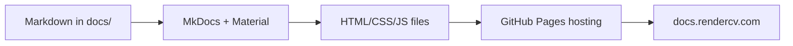

# Documentation

## The Goal

We want documentation at `docs.rendercv.com`, a proper website with navigation, search, theming, and interactive features.

**What is a website?** A collection of HTML, CSS, and JavaScript files. Browsers download these files and render them as the pages you see. To have a website, you need:

1. HTML/CSS/JavaScript files
2. A server hosting those files
3. A domain pointing to that server

**The problem:** Writing HTML/CSS/JavaScript manually for documentation is impractical. You want to write content in Markdown and have it become a professional website automatically.

**The solution:** [`mkdocs`](https://github.com/mkdocs/mkdocs) with [Material theme](https://github.com/squidfunk/mkdocs-material). You write Markdown in `docs/`, `mkdocs` generates HTML/CSS/JavaScript, and GitHub Pages hosts it at `docs.rendercv.com`.



**This means:** Editing Markdown files in `docs/` updates the website at `docs.rendercv.com`.

## Configuration: [`mkdocs.yaml`](https://github.com/rendercv/rendercv/blob/main/mkdocs.yaml)

`mkdocs.yaml` controls how `mkdocs` builds the website:

- **Site metadata:** name, description, repository
- **Theme:** Material theme with colors and features
- **Navigation:** sidebar structure
- **Plugins:** see below

## Plugins

`mkdocs` plugins extend functionality beyond Markdown → HTML conversion.

### [`mkdocstrings`](https://github.com/mkdocstrings/mkdocstrings): API Reference

Generates API reference from Python docstrings. The entire [API Reference](../api_reference/index.md) section is auto-generated from `src/rendercv/`.

### [`mkdocs-macros-plugin`](https://mkdocs-macros-plugin.readthedocs.io/): Dynamic Content

Lets you inject code-generated values into Markdown. [`docs/docs_templating.py`](https://github.com/rendercv/rendercv/blob/main/docs/docs_templating.py) runs during build. It imports values directly from RenderCV's code and exposes them as variables. It's heavily used in [YAML Input Structure](../user_guide/yaml_input_structure.md) page.

## Entry Type Figures

The [YAML Input Structure](../user_guide/yaml_input_structure.md) page shows visual examples of each entry type rendered in each theme.

These are auto-generated PNG images. Run `just update-entry-figures` to regenerate them from [`docs/user_guide/sample_entries.yaml`](https://github.com/rendercv/rendercv/blob/main/docs/user_guide/sample_entries.yaml).

## Local Preview 

```bash
just serve-docs
```

Starts a local server at `http://127.0.0.1:8000` with live reload. Edit Markdown files and see changes instantly.

```bash
just build-docs
```

Generates the final website in `site/` directory. Mainly used by GitHub workflows for final deployment (see [GitHub Workflows](github_workflows.md)).

## Deployment

Every push to `main` triggers automatic deployment.

**The workflow** ([`.github/workflows/deploy-docs.yaml`](https://github.com/rendercv/rendercv/blob/main/.github/workflows/deploy-docs.yaml)):

1. **Trigger:** Runs on every push to `main`
2. **Build step:**
      - Installs dependencies (`uv`, `just`)
      - Runs `just build-docs` to generate the website
      - Uploads the `site/` directory as an artifact
3. **Deploy step:**
      - Takes the uploaded artifact
      - Deploys it to GitHub Pages (a free static website hosting service)
      - Makes it available at `docs.rendercv.com`

## Learn More

See the [MkDocs Material documentation](https://squidfunk.github.io/mkdocs-material/) for more information.

