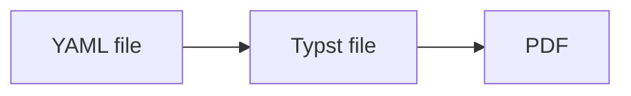
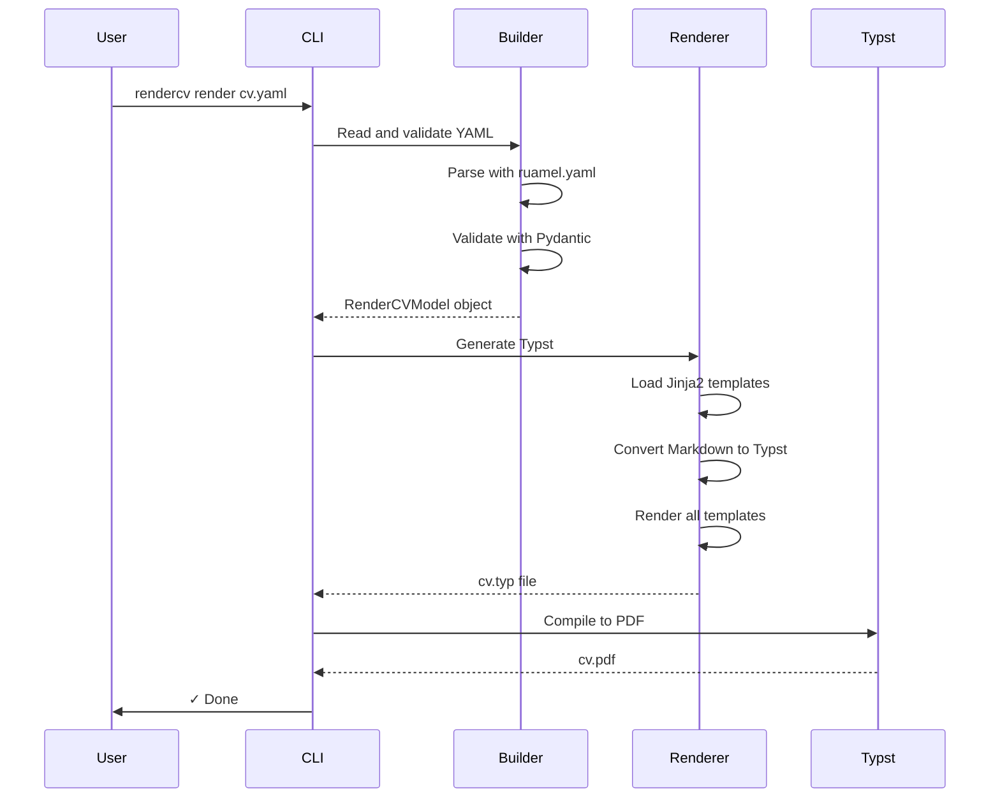

# Understanding RenderCV

This guide walks you through how RenderCV works, explaining each step and the tools we use.

## The Core Workflow

RenderCV does more than this (Markdown, HTML, PNG outputs, watching files, etc.), but at its core, it does three things:



Read a YAML file, generate a Typst file, compile it to PDF. Everything else is built on top of this foundation.

Let's understand each step.

## Step 1: Reading the YAML File

### The Problem

When a user gives us a YAML file like this:

```yaml
cv:
  name: John Doe
  location: San Francisco, CA
  sections:
    education:
      - institution: MIT
        degree: PhD
        start_date: 2020-09
        end_date: 2024-05
```

We need to:

1. Parse the YAML into Python dictionaries
2. Validate the data (Does `start_date` come before `end_date`? Is `name` actually provided?)
3. Convert it into Python objects we can work with

### Parsing: The [`ruamel.yaml`](https://github.com/pycontribs/ruamel-yaml) Library

First problem: reading YAML files.

Python doesn't have a built-in YAML library. To read YAML files, you always need a third-party library. **We use `ruamel.yaml`** - one of the best YAML parsers available.

What does it do? Simple: **converts YAML text into Python dictionaries.**

**YAML file** (`cv.yaml`):
```yaml
cv:
  name: John Doe
  location: San Francisco, CA
  sections:
    education:
      - institution: MIT
        degree: PhD
        start_date: 2020-09
```

**After parsing with `ruamel.yaml`:**
```python
from ruamel.yaml import YAML

yaml = YAML()
data = yaml.load(open("cv.yaml"))

# Now data is a Python dictionary:
{
    "cv": {
        "name": "John Doe",
        "location": "San Francisco, CA",
        "sections": {
            "education": [
                {
                    "institution": "MIT",
                    "degree": "PhD",
                    "start_date": "2020-09"
                }
            ]
        }
    }
}

# You can access it like any Python dict:
data["cv"]["name"]  # "John Doe"
data["cv"]["sections"]["education"][0]["institution"]  # "MIT"
```

That's it. YAML text becomes a Python dictionary we can work with.

**Where we use it:** `src/rendercv/schema/yaml_reader.py` - The `read_yaml()` function

### Validation: The [`pydantic`](https://github.com/pydantic/pydantic) Library

Second problem: validating the data.

Doing this manually would be a nightmare:

```python
# Manual validation (terrible approach)
if "cv" not in data:
    raise ValueError("Missing 'cv' field")

if "name" not in data["cv"]:
    raise ValueError("Missing 'name' field")

name = data["cv"]["name"]
if not isinstance(name, str):
    raise ValueError("name must be a string")
if len(name) == 0:
    raise ValueError("name cannot be empty")

if "sections" in data["cv"]:
    sections = data["cv"]["sections"]
    if not isinstance(sections, dict):
        raise ValueError("sections must be a dictionary")

    for section_name, entries in sections.items():
        if not isinstance(entries, list):
            raise ValueError(f"{section_name} must be a list")

        for entry in entries:
            if "start_date" in entry and "end_date" in entry:
                # Parse dates, compare them...
                # This is already getting crazy and we're barely started
```

This approach:

- Requires hundreds of lines for all fields
- Is error-prone (easy to forget checks)
- Is hard to maintain (changing structure means updating validation everywhere)
- Gives terrible error messages

**We use the `pydantic` third-party library** instead. Think of it as a blueprint system.

You define what your data *should* look like using classes:

```python
from pydantic import BaseModel

class Education(BaseModel):
    institution: str
    degree: str
    start_date: str
    end_date: str

class CV(BaseModel):
    name: str  # Required field
    location: str | None = None  # Optional field
    sections: dict[str, list[Education]]  # Nested structure
```

Then you validate in one line:

```python
cv = CV.model_validate(data)
# If data is invalid, pydantic raises ValidationError with details
# If data is valid, you get a clean object: cv.name, cv.location, etc.
```

Now you have a clean Python object instead of a messy dictionary:

```python
# Before (raw dictionary - error-prone):
institution = data["cv"]["sections"]["education"][0]["institution"]

# After (pydantic model - clean and type-safe):
institution = cv.sections["education"][0].institution
# Your IDE autocompletes .institution because it knows it's an Education object
```

**Why this is powerful:**

You write the structure once, and `pydantic`:

- Checks types (is `name` a string? is `institution` a string?)
- Checks required fields (is `name` present? is `institution` present?)
- Handles optional fields (is `location` present or None?)
- Validates nested structures (each item in `sections["education"]` must be a valid `Education` object)
- Lets you define custom validators for complex logic

**Custom validators example:**

You can define your own validation logic:

```python
class Education(BaseModel):
    start_date: Date
    end_date: Date

    @pydantic.model_validator(mode="after")
    def check_dates(self):
        # Custom logic: start_date must be before end_date
        if self.start_date > self.end_date:
            raise ValueError("start_date cannot be after end_date")
        return self
```

Now `pydantic` runs your custom validator on every `Education` object. See `src/rendercv/schema/models/cv/entries/bases/entry_with_complex_fields.py` for real examples.

### How We Use Them Together

Our main data model is `RenderCVModel` in `src/rendercv/schema/models/rendercv_model.py`:

```python
class RenderCVModel(BaseModel):
    cv: Cv                    # The CV content
    design: Design            # Colors, fonts, margins
    locale: Locale            # Language settings (month names, etc.)
    settings: Settings        # Rendering options
```

Each of these is another `pydantic` model. For example, `Cv` in `src/rendercv/schema/models/cv/cv.py`:

```python
class Cv(BaseModel):
    name: str | None = None           # Optional
    location: str | None = None       # Optional
    email: EmailStr | None = None     # Optional, but validated as email if provided
    phone: PhoneNumber | None = None  # Optional, but validated as phone if provided
    sections: dict[str, Section] | None = None
```

**The pipeline:**

1. **`ruamel.yaml`** parses YAML → Python dictionary
2. **`pydantic`** validates dictionary → `RenderCVModel` (clean Python object)
3. If validation fails, we display a detailed error table

**Result:** Instead of cryptic error messages, users get a formatted table:

| Location | Input Value | Explanation |
|----------|-------------|-------------|
| cv.email.0 | not_a_valid_email | An email address must have an @-sign. |
| cv.phone | not_a_valid_phone_number | This is not a valid phone number. |

This error table is displayed by `src/rendercv/cli/render_command/progress_panel.py`.

**Where to look:**

- `src/rendercv/schema/rendercv_model_builder.py` - How we validate YAML
- `src/rendercv/schema/models/` - All the `pydantic` model definitions
- `src/rendercv/schema/pydantic_error_handling.py` - `pydantic` validation error parsing

## Step 2: Generating the Typst File

### The Problem

We have a validated `RenderCVModel` object. Now we need to generate a Typst file:

```typst
#show heading: set text(rgb(0, 79, 144))

= John Doe
San Francisco, CA

== Education
#strong[MIT] #h(1fr) 2020 – 2024
PhD in Computer Science
```

We could build this with string concatenation:

```python
# String concatenation approach
typst = f"#show heading: set text(rgb({color}))\n\n"
typst += f"= {cv.name}\n"
if cv.location:
    typst += f"{cv.location}\n"
typst += "\n"

for section_title, entries in cv.sections.items():
    typst += f"== {section_title}\n"
    for entry in entries:
        # Wait, what if this is an education entry vs experience entry?
        # Different formatting needed...
        # What about proper spacing? Line breaks? Escaping special characters?
        # What if we have 5 different themes with different layouts?
        # This becomes impossibly complex...
```

**The problem:** String concatenation for complex text generation is **impossibly hard**. You're trying to:

- Handle conditional formatting (if field exists, show it)
- Escape special characters properly (# $ [ ] are special in Typst)
- Manage indentation and spacing across hundreds of lines
- Support multiple themes with completely different layouts
- Handle different entry types (education, experience, publication, etc.)
- Keep everything readable and maintainable

This is why **templating engines were invented**. When you need to programmatically generate complex text files, string concatenation doesn't scale. You need templates.

### The [`jinja2`](https://github.com/pallets/jinja) Templating Library

**We use the `jinja2` third-party library**. It's a template engine - you write templates with placeholders, and `jinja2` fills them in with data.

**Template file** (`Header.j2.typ`):
```jinja2
= {{ cv.name }}

{{ cv.location }}



#link("mailto:{{ cv.email }}")

```

**Python code:**
```python
template = jinja2_env.get_template("Header.j2.typ")
output = template.render(cv=rendercv_model.cv)
```

**Output:**
```typst
= John Doe
San Francisco, CA

#link("mailto:john@example.com")
```

**Why templates:**

Templating is the only practical way to generate complex text files programmatically. String concatenation simply cannot handle the complexity of generating formatted documents with conditional logic, proper escaping, and multiple layouts.

### How We Use It

Each part of the CV has its own template file in `src/rendercv/renderer/templater/templates/typst/`:

- `Preamble.j2.typ` - Typst configuration (fonts, colors, spacing)
- `Header.j2.typ` - Name, contact info
- `SectionBeginning.j2.typ` - Section title
- `entries/EducationEntry.j2.typ` - How education entries are formatted
- `entries/ExperienceEntry.j2.typ` - How experience entries are formatted
- `entries/PublicationEntry.j2.typ` - How publication entries are formatted

The `src/rendercv/renderer`:

1. Renders each template with the CV data
2. Assembles them: Preamble + Header + Sections
3. Writes the final Typst file

Users can override any template by placing their own version in a theme folder next to their CV file.

**Where to look:**

- `src/rendercv/renderer/templater/templater.py` - Template rendering logic
- `src/rendercv/renderer/templater/templates/typst/` - The actual template files

### Special Case: Markdown Support

RenderCV supports Markdown in YAML files:

```yaml
highlights:
  - "**Published** [3 papers](https://example.com) on neural networks"
  - "Collaborated with *Professor Smith* on deep learning research"
```

Typst doesn't understand Markdown. We need to convert:

- `**bold**` → `#strong[bold]`
- `[link](url)` → `#link("url")[link]`
- `*italic*` → `#emph[italic]`

### The [`markdown`](https://github.com/Python-Markdown/markdown) Library

**We use the `markdown` third-party library**. It parses Markdown into a tree structure, then we walk the tree and convert each element to Typst syntax.

How it works:

```python
# markdown parses: "**bold** text"
# We convert the tree to: "#strong[bold] text"
```

The conversion logic uses pattern matching:

```python
match element.tag:
    case "strong":
        return f"#strong[{content}]"
    case "em":
        return f"#emph[{content}]"
    case "a":
        return f'#link("{url}")[{content}]'
```

**Where to look:**

- `src/rendercv/renderer/templater/markdown_parser.py` - Markdown → Typst conversion

## Step 3: Compiling to PDF

Once we have a `.typ` file, we need to compile it to PDF.

### The [`typst`](https://github.com/messense/typst-py) Library

**We use the [`typst`](https://github.com/messense/typst-py) third-party library**. It's Python bindings for the Typst compiler.

```python
from typst import compile

compile("cv.typ", output="cv.pdf")
```

That's it. This library wraps the Typst compiler so users don't need to install Typst separately.

**Where to look:**

- `src/rendercv/renderer/pdf_png.py` - PDF and PNG generation

## The Command-Line Interface

Users interact with RenderCV through terminal commands:

```bash
rendercv new "John Doe"
rendercv render cv.yaml
rendercv render cv.yaml --watch
```

### The [`typer`](https://github.com/fastapi/typer) Library

**We use the `typer` third-party library**. It builds CLI applications from Python functions.

You write a normal Python function:

```python
def render_command(
    input_file: pathlib.Path,
    watch: bool = False,
    pdf_path: pathlib.Path | None = None
):
    # Your rendering logic here
    run_rendercv(input_file, ...)
```

`typer` automatically:

- Creates the `rendercv render` command
- Adds `--watch` flag for the `watch` parameter
- Adds `--pdf-path` option for the `pdf_path` parameter
- Validates that `input_file` is a path that exists
- Generates help text from docstrings
- Handles errors and displays them nicely

The `src/rendercv/cli` is defined in `src/rendercv/cli/app.py`. Commands auto-register from files named `*_command.py` in the `cli/` directory.

**Where to look:**

- `src/rendercv/cli/app.py` - Main CLI application
- `src/rendercv/cli/render_command/render_command.py` - The `render` command
- `src/rendercv/cli/new_command/new_command.py` - The `new` command

### The --watch Flag

When you run `rendercv render cv.yaml --watch`, RenderCV monitors your YAML file and automatically rerenders when you make changes.

### The [`watchdog`](https://github.com/gorakhargosh/watchdog) Library

**We use the `watchdog` third-party library**. It watches the YAML file for changes. When the file is updated, it automatically runs RenderCV again.

**Where to look:** `src/rendercv/cli/render_command/watcher.py`

## Putting It All Together

Here's what happens when you run `rendercv render cv.yaml`:



**Code flow:**

1. `src/rendercv/cli/render_command/render_command.py` - CLI entry point (`typer`)
2. `src/rendercv/cli/render_command/run_rendercv.py` - Main orchestration
3. `src/rendercv/schema/rendercv_model_builder.py` - YAML → `pydantic` model (`ruamel.yaml` + `pydantic`)
4. `src/rendercv/renderer/typst.py` - `pydantic` model → Typst file (`jinja2` + `markdown`)
5. `src/rendercv/renderer/pdf_png.py` - Typst file → PDF (`typst` library)

## Python Features Worth Knowing

To understand RenderCV's code, you should know these Python features we use extensively:

### Type Hints

Every function has type annotations:

```python
def render_full_template(
    rendercv_model: RenderCVModel,
    file_type: Literal["typst", "markdown"]
) -> str:
```

This helps:

- IDEs provide autocomplete
- Pyright catches type errors before you run the code
- Documents what functions expect and return

### Exception Handling

We use `try/except` blocks to catch and handle errors gracefully:

```python
try:
    # Try to validate YAML and render CV
    rendercv_model = build_rendercv_model(yaml_file)
    generate_typst(rendercv_model)
    generate_pdf(rendercv_model)
except RenderCVUserValidationError as e:
    # Show validation errors in a nice table
    display_validation_errors(e.validation_errors)
except RenderCVUserError as e:
    # Show user-friendly error message
    display_error(e.message)
except jinja2.TemplateSyntaxError as e:
    # Template has syntax error
    display_error(f"Template error at line {e.lineno}")
```

This ensures users never see ugly Python stack traces - they get helpful error messages instead.

**Where to look:** `src/rendercv/cli/render_command/run_rendercv.py`

### Functools Caching

In `src/rendercv/renderer/templater`, templates and regex patterns don't change during a render, so we cache them:

```python
@functools.lru_cache(maxsize=1)
def get_jinja2_environment(...):
    # Create Jinja2 environment
    # This only runs once, subsequent calls return cached result
```

This makes repeated template rendering fast.

### Regular Expressions

Used heavily for text processing:

- `src/rendercv/renderer/templater/string_processor.py` - Escaping Typst special characters (`#`, `$`, `[`, etc.)
- `src/rendercv/renderer/templater/markdown_parser.py` - Finding Typst commands to preserve during Markdown parsing
- `src/rendercv/schema/models/` - Validating formats (URLs, colors, etc.)

Example:
```python
# Find all Typst commands like #link(...)[...] or #strong[...]
typst_command_pattern = re.compile(
    r"#([A-Za-z][^\s()\[]*)(\([^)]*\))?(\[[^\]]*\])?"
)
```

### Pattern Matching

Python's `match/case` for clean conditionals:

```python
match element.tag:
    case "strong":
        return f"#strong[{content}]"
    case "em":
        return f"#emph[{content}]"
    case "a":
        return f'#link("{url}")[{content}]'
```

## Where to Start Reading

To understand the codebase:

1. **Main flow**: Start with `src/rendercv/cli/render_command/run_rendercv.py` - See the entire pipeline
2. **Data structures**: Read `src/rendercv/schema/models/rendercv_model.py` - Understand what data RenderCV works with
3. **Template rendering**: Check `src/rendercv/renderer/templater/templater.py` - See how Jinja2 templates are assembled
4. **Markdown handling**: Look at `src/rendercv/renderer/templater/markdown_parser.py` - Understand Markdown → Typst conversion

Each file has docstrings explaining the "why" behind the code, not just the "what".
