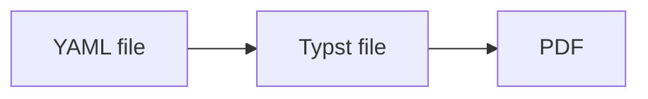

# Understanding RenderCV

This guide walks you through how RenderCV works, explaining each step and the tools we use.

## The Core Workflow

RenderCV does more than this (Markdown, HTML, PNG outputs, watching files, etc.), but at its core, what happens is:



Read a YAML file, generate a Typst file, compile it to PDF. Everything else is built on top of this foundation.

Let's understand each step.

## Step 1: Reading the YAML File

When a user gives us a YAML file like this:

```yaml
cv:
  name: John Doe
  location: San Francisco, CA
  sections:
    education:
      - institution: MIT
        degree: PhD
        start_date: 2020-09
        end_date: 2024-05
```

We need to:

1. Parse the YAML into Python dictionaries
2. Validate the data (Does `start_date` come before `end_date`? Is `name` actually provided and is it a string?)

### [`ruamel.yaml`](https://github.com/pycontribs/ruamel-yaml): YAML Parser

First problem: reading YAML files.

Python doesn't have a built-in YAML library. To read YAML files, you need a library. **We use `ruamel.yaml`**, one of the best YAML parsers available.

What does it do? Simple: **converts YAML text into Python dictionaries.**

**YAML file** (`cv.yaml`):
```yaml
cv:
  name: John Doe
  location: San Francisco, CA
  sections:
    education:
      - institution: MIT
        degree: PhD
        start_date: 2020-09
```

**After parsing with `ruamel.yaml`:**
```python
from ruamel.yaml import YAML

yaml = YAML()
data = yaml.load(open("cv.yaml"))

# Now data is a Python dictionary:
{
    "cv": {
        "name": "John Doe",
        "location": "San Francisco, CA",
        "sections": {
            "education": [
                {
                    "institution": "MIT",
                    "degree": "PhD",
                    "start_date": "2020-09"
                }
            ]
        }
    }
}

# You can access it like any Python dict:
data["cv"]["name"]  # "John Doe"
data["cv"]["sections"]["education"][0]["institution"]  # "MIT"
```

That's it. YAML text becomes a Python dictionary we can work with.

`ruamel.yaml` is being called in [`src/rendercv/schema/yaml_reader.py`](https://github.com/rendercv/rendercv/blob/main/src/rendercv/schema/yaml_reader.py).

### [`pydantic`](https://github.com/pydantic/pydantic): Python Dictionary Validator

Now we have a dictionary. We need to validate it. Without a library, you'd write:

```python
if "name" not in data["cv"]:
    raise ValueError("Missing 'name' field")

if not isinstance(data["cv"]["name"], str):
    raise ValueError("name must be a string")

if "sections" in data["cv"]:
    for section_name, entries in data["cv"]["sections"].items():
        for entry in entries:
            if "start_date" in entry and "end_date" in entry:
                # Parse dates, compare them...
                # This is already hundreds of lines and we're barely started
```

With `pydantic`, we can define the structure once:

```python
from pydantic import BaseModel
from datetime import date as Date

class Education(BaseModel):
    institution: str
    start_date: Date
    end_date: Date

    @pydantic.model_validator(mode="after")
    def check_dates(self):
        if self.start_date > self.end_date:
            raise ValueError("start_date cannot be after end_date")
        return self

class Cv(BaseModel):
    name: str
    location: str | None = None
    education: list[Education]
```

Then validate:

```python
# This dictionary (from ruamel.yaml):
data = {
    "name": "John Doe",
    "location": "San Francisco",
    "education": [
        {
            "institution": "MIT",
            "start_date": "2020-09",
            "end_date": "2024-05"
        }
    ]
}

# Becomes this validated object:
cv = Cv.model_validate(data)

# Now you have clean, validated objects:
cv.name  # "John Doe"
cv.education[0].institution  # "MIT"
cv.education[0].start_date  # "2020-09", guaranteed dates are valid
```

That's the power. Dictionary goes in, `pydantic` checks everything, clean Python object comes out.


**RenderCV's entire data model is `pydantic` models all the way down:**

```python
class RenderCVModel(BaseModel):
    cv: Cv              # ← pydantic model
    design: Design      # ← pydantic model
    locale: Locale      # ← pydantic model
    settings: Settings  # ← pydantic model
```

Each field is another `pydantic` model. `Cv` contains more `pydantic` models like `EducationEntry`, `ExperienceEntry`, etc. It's nested validation: when you validate `RenderCVModel`, `pydantic` automatically validates every nested model too. One `model_validate()` call checks the entire structure.

See [`src/rendercv/schema/models/rendercv_model.py`](https://github.com/rendercv/rendercv/blob/main/src/rendercv/schema/models/rendercv_model.py) for the top-level model.

## Step 2: Generating the Typst File

Now we need to generate a Typst file:

```typst
= John Doe
San Francisco, CA

== Education
#strong[MIT] #h(1fr) 2020 – 2024
PhD in Computer Science
```

You could try string concatenation:

```python
typst = f"= {cv.name}\n"
if cv.location:
    typst += f"{cv.location}\n"
typst += "\n"

for section_title, entries in cv.sections.items():
    typst += f"== {section_title}\n"
    for entry in entries:
        typst += f"#strong[{entry.institution}]"
        # What about optional fields? Spacing? Line breaks?
        # Multiple themes with different layouts?
        # This is impossible to maintain!
```

This doesn't work. You're building hundreds of lines of string concatenation logic, handling conditionals, managing whitespace. It's unworkable.

This is why **templating engines were invented**. When you need to programmatically generate complex text files, you need templates.

### [`jinja2`](https://github.com/pallets/jinja): Templating Engine

`jinja2` is the most famous templating engine for Python.

**Template file** (`Header.j2.typ`):
```jinja2
= {{ cv.name }}

{{ cv.location }}



#link("mailto:{{ cv.email }}")

```

**Python code:**
```python
template = jinja2_env.get_template("Header.j2.typ")
output = template.render(cv=cv)
```

**Result:**
```typst
= John Doe
San Francisco, CA

#link("mailto:john@example.com")
```

Clean separation: templates define layout, Python code provides data. Users can override templates to customize their CV without touching Python code.

Typst templates live in [`src/rendercv/renderer/templater/templates/typst/`](https://github.com/rendercv/rendercv/blob/main/src/rendercv/renderer/templater/templates/typst/).

`jinja2` is being called in [`src/rendercv/renderer/templater/templater.py`](https://github.com/rendercv/rendercv/blob/main/src/rendercv/renderer/templater/templater.py).

### [`markdown`](https://github.com/Python-Markdown/markdown): Markdown to Typst

Users want to write Markdown in their YAML:

```yaml
highlights:
  - "**Published** [3 papers](https://example.com) on neural networks"
  - "Collaborated with *Professor Smith*"
```

But Typst doesn't understand `**bold**` or `[links](url)`. We need Typst syntax: `#strong[bold]` and `#link("url")[text]`.

**We use the `markdown` library.** It parses Markdown into an XML tree. Then we walk the tree and convert each element to Typst:

```python
match element.tag:
    case "strong":
        return f"#strong[{content}]"
    case "em":
        return f"#emph[{content}]"
    case "a":
        href = element.get("href")
        return f'#link("{href}")[{content}]'
```

Result: `#strong[Published] #link("https://example.com")[3 papers]`

See [`src/rendercv/renderer/templater/markdown_parser.py`](https://github.com/rendercv/rendercv/blob/main/src/rendercv/renderer/templater/markdown_parser.py). The `markdown_to_typst()` function does this conversion.

## Step 3: Compiling to PDF

### [`typst`](https://github.com/messense/typst-py): Typst Compiler

`typst` library is the Python bindings for the Typst compiler.

```python
from typst import compile
compile("cv.typ", output="cv.pdf")
```

Done. Typst file has been compiled to PDF.

`typst` is being called in [`src/rendercv/renderer/pdf_png.py`](https://github.com/rendercv/rendercv/blob/main/src/rendercv/renderer/pdf_png.py).

## The Complete Pipeline

When you run `rendercv render cv.yaml`:

1. **Parse** - `ruamel.yaml` reads YAML → Python dict
2. **Validate** - `pydantic` validates dict → `RenderCVModel` object
3. **Generate** - `jinja2` renders templates with data → Typst file
4. **Compile** - `typst` compiles Typst → PDF

Everything else (Markdown support, watch mode, PNG output, HTML export) builds on this core.

## Learn More

1. [`src/rendercv/cli/render_command/run_rendercv.py`](https://github.com/rendercv/rendercv/blob/main/src/rendercv/cli/render_command/run_rendercv.py): The complete flow
2. [`src/rendercv/schema/models/rendercv_model.py`](https://github.com/rendercv/rendercv/blob/main/src/rendercv/schema/models/rendercv_model.py): The top-level Pydantic model
3. [`src/rendercv/renderer/templater/templater.py`](https://github.com/rendercv/rendercv/blob/main/src/rendercv/renderer/templater/templater.py): Template rendering
