# RenderCV Architecture Blueprint

## Table of Contents
1. [Overview](#overview)
2. [Architecture Layers](#architecture-layers)
3. [Main Workflow Diagrams](#main-workflow-diagrams)
4. [Key Components Deep Dive](#key-components-deep-dive)
5. [Error Handling System](#error-handling-system)
6. [Data Flow](#data-flow)

## Overview

RenderCV is a command-line tool for rendering CVs from YAML input files into multiple output formats (PDF, PNG, Markdown, HTML). The application is built with a clean, layered architecture that separates concerns between CLI, data modeling, validation, and rendering.

### Core Philosophy
- **YAML-driven**: All CV content and design configuration comes from YAML files
- **Multi-format output**: Single source (YAML) generates Typst → PDF/PNG and Markdown → HTML
- **Type-safe validation**: Pydantic models ensure data integrity with detailed error reporting
- **Template-based rendering**: Jinja2 templates allow theme customization
- **Live progress feedback**: Real-time rendering progress with timing information

## Architecture Layers

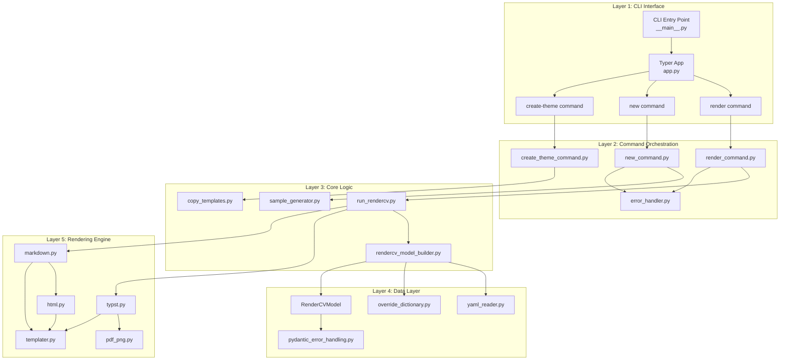

## Main Workflow Diagrams

### 1. Application Entry Point

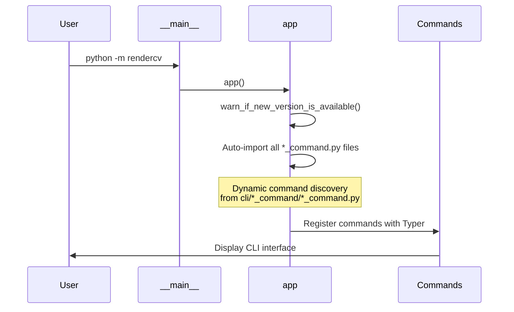

### 2. Complete Render Command Workflow

This is the heart of RenderCV - the complete workflow from YAML input to multiple output formats.

```mermaid
sequenceDiagram
    participant User
    participant CLI as cli_command_render
    participant Wrapper as run_rendercv_wrapper
    participant RUN as run_rendercv
    participant Progress as RenderProgress
    participant Live as rich.live.Live
    participant Builder as build_rendercv_dictionary_and_model
    participant YAML as read_yaml
    participant Override as apply_overrides
    participant Model as RenderCVModel
    participant Typst as generate_typst
    participant Templater as render_full_template
    participant PDF as generate_pdf
    participant PNG as generate_png
    participant MD as generate_markdown
    participant HTML as generate_html
    participant Compiler as Typst Compiler

    User->>CLI: rendercv render input.yaml

    Note over CLI: Parse CLI arguments:<br/>- design/locale/settings overlays<br/>- output paths<br/>- dont_generate_* flags<br/>- overrides (--cv.phone "123")

    CLI->>CLI: parse_override_arguments()
    Note over CLI: Convert --key value pairs<br/>to override dictionary

    CLI->>Wrapper: Call run_rendercv_wrapper()

    alt quiet mode
        Wrapper->>RUN: run_rendercv_quietly()
    else normal mode
        Wrapper->>RUN: run_rendercv()
    end

    RUN->>Progress: Create RenderProgress()
    RUN->>Live: Start Live display

    rect rgb(200, 220, 250)
        Note over RUN,Model: Step 1: Validation
        RUN->>Builder: timed_step("Validated the input file")
        Builder->>YAML: read_yaml(main_input_file)
        YAML-->>Builder: CommentedMap with location info

        opt YAML overlays provided
            Builder->>YAML: read_yaml(design_file)
            Builder->>YAML: read_yaml(locale_file)
            Builder->>YAML: read_yaml(settings_file)
            Builder->>Builder: Merge overlays into main dict
        end

        opt Render command overrides
            Builder->>Builder: Set output paths in settings.render_command
        end

        opt CLI overrides (--key value)
            Builder->>Override: apply_overrides_to_dictionary()
            Override->>Override: update_value_by_location() recursively
            Note over Override: Navigate dict/list structure<br/>using dotted notation
        end

        Builder->>Model: RenderCVModel.model_validate()

        alt Validation succeeds
            Model->>Model: Pydantic validates all fields
            Model-->>Builder: RenderCVModel instance
            Builder-->>RUN: (dict, model)
            RUN->>Progress: Add CompletedStep
            RUN->>Live: Update display with timing
        else ValidationError
            Model-->>Builder: pydantic.ValidationError
            Builder->>Builder: parse_validation_errors()
            Builder->>Builder: Raise RenderCVUserValidationError
            RUN->>Live: Clear display
            RUN->>RUN: print_validation_errors()
            RUN-->>User: Error table displayed
        end
    end

    rect rgb(220, 250, 220)
        Note over RUN,Typst: Step 2: Generate Typst
        RUN->>Typst: timed_step("Generated Typst")

        opt dont_generate_typst
            Typst-->>RUN: None (skip)
        end

        Typst->>Typst: resolve_rendercv_file_path()
        Note over Typst: Substitute placeholders:<br/>NAME, YEAR, MONTH, etc.

        Typst->>Templater: render_full_template(model, "typst")

        Templater->>Templater: process_model(model, "typst")
        Note over Templater: Pre-process data:<br/>- Parse markdown<br/>- Format dates<br/>- Process connections

        Templater->>Templater: render Preamble.j2.typ
        Note over Templater: Page setup, fonts, styles

        Templater->>Templater: render Header.j2.typ
        Note over Templater: Name, contact info, photo

        loop For each section in cv.rendercv_sections
            Templater->>Templater: render SectionBeginning.j2.typ
            loop For each entry in section
                Templater->>Templater: render entries/{entry_type}.j2.typ
                Note over Templater: Entry types: OneLineEntry,<br/>NormalEntry, ExperienceEntry,<br/>EducationEntry, etc.
            end
            Templater->>Templater: render SectionEnding.j2.typ
        end

        Templater-->>Typst: Complete Typst code string
        Typst->>Typst: typst_path.write_text()
        Typst-->>RUN: typst_path
        RUN->>Progress: Add CompletedStep
        RUN->>Live: Update display
    end

    rect rgb(250, 220, 220)
        Note over RUN,PDF: Step 3: Generate PDF
        RUN->>PDF: timed_step("Generated PDF")

        opt dont_generate_pdf or typst_path is None
            PDF-->>RUN: None (skip)
        end

        PDF->>PDF: resolve_rendercv_file_path()
        PDF->>PDF: get_typst_compiler()
        Note over PDF: Cached compiler with:<br/>- Font paths<br/>- Input file context

        opt Photo exists
            PDF->>PDF: copy_photo_next_to_typst_file()
            Note over PDF: Typst needs photo in same dir
        end

        PDF->>Compiler: compiler.compile(format="pdf")
        Compiler->>Compiler: Typst compilation
        Compiler-->>PDF: PDF bytes
        PDF->>PDF: Write to pdf_path
        PDF-->>RUN: pdf_path
        RUN->>Progress: Add CompletedStep
        RUN->>Live: Update display
    end

    rect rgb(250, 240, 200)
        Note over RUN,PNG: Step 4: Generate PNG
        RUN->>PNG: timed_step("Generated PNG")

        opt dont_generate_png or typst_path is None
            PNG-->>RUN: None (skip)
        end

        PNG->>PNG: resolve_rendercv_file_path()
        PNG->>PNG: get_typst_compiler()
        PNG->>PNG: copy_photo_next_to_typst_file()
        PNG->>Compiler: compiler.compile(format="png")
        Compiler-->>PNG: List of PNG bytes (one per page)

        loop For each page
            PNG->>PNG: Write png_file_{i+1}.png
        end

        PNG-->>RUN: List of png_paths
        RUN->>Progress: Add CompletedStep (plural if multiple)
        RUN->>Live: Update display
    end

    rect rgb(240, 220, 250)
        Note over RUN,MD: Step 5: Generate Markdown
        RUN->>MD: timed_step("Generated Markdown")

        opt dont_generate_markdown
            MD-->>RUN: None (skip)
        end

        MD->>MD: resolve_rendercv_file_path()
        MD->>Templater: render_full_template(model, "markdown")

        Templater->>Templater: process_model(model, "markdown")
        Templater->>Templater: render Header.j2.md

        loop For each section
            Templater->>Templater: render SectionBeginning.j2.md
            loop For each entry
                Templater->>Templater: render entries/{entry_type}.j2.md
            end
            Templater->>Templater: render SectionEnding.j2.md
        end

        Templater-->>MD: Complete Markdown string
        MD->>MD: markdown_path.write_text()
        MD-->>RUN: markdown_path
        RUN->>Progress: Add CompletedStep
        RUN->>Live: Update display
    end

    rect rgb(200, 240, 250)
        Note over RUN,HTML: Step 6: Generate HTML
        RUN->>HTML: timed_step("Generated HTML")

        opt dont_generate_html or markdown_path is None
            HTML-->>RUN: None (skip)
        end

        HTML->>HTML: resolve_rendercv_file_path()
        HTML->>HTML: Read markdown_path contents
        HTML->>Templater: render_html(model, markdown_text)
        Templater->>Templater: markdown_to_html()
        Note over Templater: python-markdown library<br/>converts MD to HTML body
        Templater->>Templater: render Full.html template
        Note over Templater: Wraps HTML body with:<br/>- CSS styling<br/>- Metadata<br/>- Responsive layout
        Templater-->>HTML: Complete HTML string
        HTML->>HTML: html_path.write_text()
        HTML-->>RUN: html_path
        RUN->>Progress: Add CompletedStep
        RUN->>Live: Update display
    end

    RUN->>Live: Update title to "Your CV is ready"
    RUN-->>User: Success with timing info
```

### 3. New Command Workflow

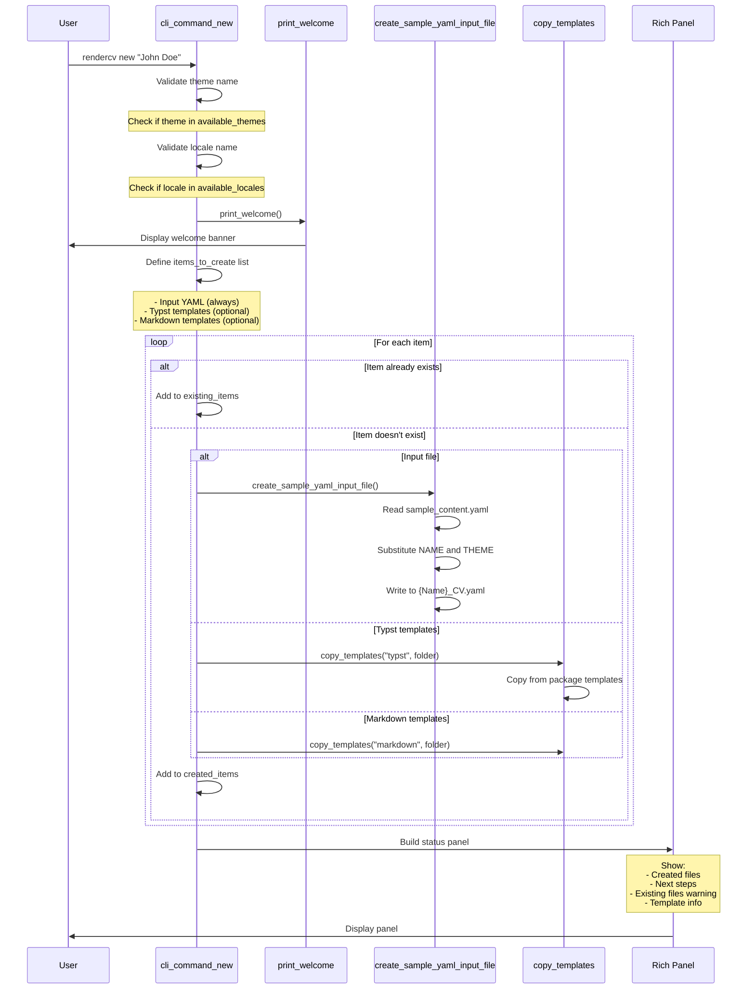

### 4. Create Theme Command Workflow

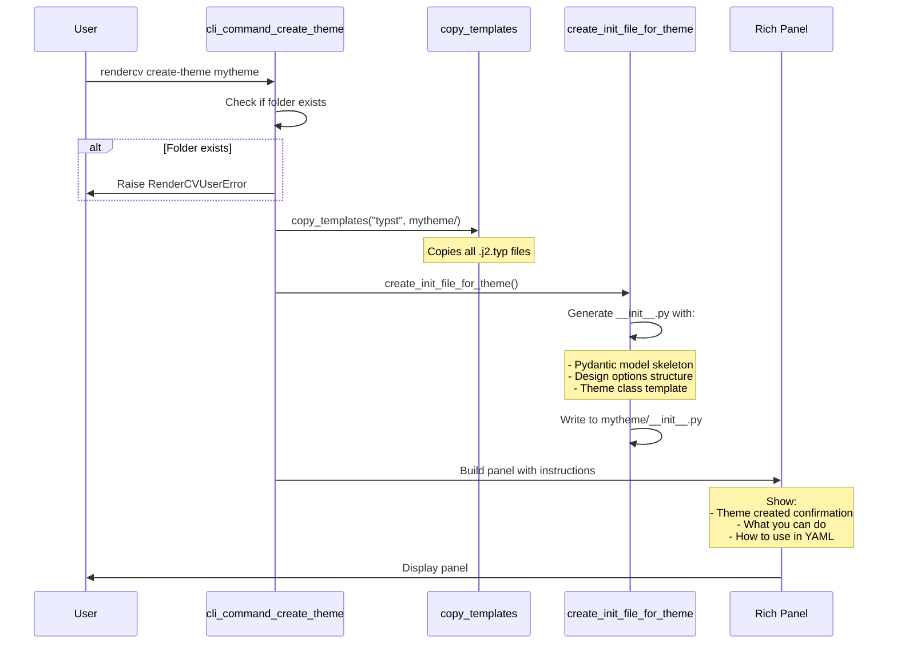

### 5. Model Building and Validation Pipeline

```mermaid
sequenceDiagram
    participant Caller
    participant Builder as build_rendercv_dictionary_and_model
    participant YAML as read_yaml
    participant Override as override_dictionary
    participant Model as RenderCVModel
    participant Pydantic
    participant ErrorHandler as parse_validation_errors
    participant Context as ValidationContext

    Caller->>Builder: build_rendercv_dictionary_and_model()

    rect rgb(240, 240, 250)
        Note over Builder,YAML: Phase 1: Read YAML
        Builder->>YAML: read_yaml(main_input_file)
        YAML->>YAML: Check file exists and extension
        YAML->>YAML: Read file contents
        YAML->>YAML: Create ruamel.yaml.YAML(typ=None)
        Note over YAML: Preserves comments and positions
        YAML->>YAML: Disable ISO date parsing
        Note over YAML: Keep dates as strings for validation
        YAML-->>Builder: CommentedMap with lc.data
        Note over YAML: lc.data contains line/column info<br/>for each key
    end

    rect rgb(250, 240, 240)
        Note over Builder: Phase 2: Apply Overlays
        opt design_file provided
            Builder->>YAML: read_yaml(design_file)
            YAML-->>Builder: design_dict
            Builder->>Builder: input_dict["design"] = design_dict["design"]
        end

        opt locale_file provided
            Builder->>YAML: read_yaml(locale_file)
            YAML-->>Builder: locale_dict
            Builder->>Builder: input_dict["locale"] = locale_dict["locale"]
        end

        opt settings_file provided
            Builder->>YAML: read_yaml(settings_file)
            YAML-->>Builder: settings_dict
            Builder->>Builder: input_dict["settings"] = settings_dict["settings"]
        end
    end

    rect rgb(240, 250, 240)
        Note over Builder,Override: Phase 3: Apply Render Command Overrides
        Builder->>Builder: Create settings.render_command if not exists

        loop For each render_override (paths, flags)
            opt Override value provided
                Builder->>Builder: Set in input_dict["settings"]["render_command"]
            end
        end
    end

    rect rgb(250, 250, 240)
        Note over Builder,Override: Phase 4: Apply CLI Overrides
        opt CLI overrides provided (--key value)
            Builder->>Override: apply_overrides_to_dictionary()

            loop For each override
                Override->>Override: update_value_by_location()
                Override->>Override: Split key by dots
                Note over Override: Example: cv.sections.education.0.institution
                Override->>Override: Traverse structure recursively

                alt List encountered
                    Override->>Override: Parse index as integer
                    Override->>Override: Validate index in range
                else Dict encountered
                    Override->>Override: Navigate to key
                end

                Override->>Override: Set final value
            end

            Override-->>Builder: Updated dictionary
        end
    end

    rect rgb(240, 240, 255)
        Note over Builder,Pydantic: Phase 5: Build Pydantic Model
        Builder->>Context: Create ValidationContext
        Note over Context: Contains:<br/>- input_file_path<br/>- current_date

        Builder->>Model: RenderCVModel.model_validate(dict, context)
        Model->>Pydantic: Validate cv field
        Note over Pydantic: Required field with all CV content
        Model->>Pydantic: Validate design field
        Note over Pydantic: Discriminated union by theme name<br/>Default: ClassicTheme
        Model->>Pydantic: Validate locale field
        Note over Pydantic: Discriminated union by locale name<br/>Default: EnglishLocale
        Model->>Pydantic: Validate settings field
        Note over Pydantic: Default: Settings()

        alt Validation successful
            Pydantic-->>Model: All fields valid
            Model->>Model: set_input_file_path() via validator
            Model-->>Builder: RenderCVModel instance
            Builder-->>Caller: (CommentedMap, RenderCVModel)
        else Validation error
            Pydantic-->>Model: pydantic.ValidationError
            Model->>ErrorHandler: parse_validation_errors(error, dict)

            loop For each plain_error
                ErrorHandler->>ErrorHandler: parse_plain_pydantic_error()
                ErrorHandler->>ErrorHandler: Clean error message
                ErrorHandler->>ErrorHandler: Remove unwanted location elements
                ErrorHandler->>ErrorHandler: Get coordinates from CommentedMap.lc.data
                Note over ErrorHandler: Maps error to exact YAML line/column
                ErrorHandler->>ErrorHandler: Look up friendly message in error_dictionary.yaml
            end

            ErrorHandler->>ErrorHandler: Remove duplicate errors
            ErrorHandler-->>Model: List of RenderCVValidationError
            Model->>Caller: Raise RenderCVUserValidationError
        end
    end
```

### 6. Template Rendering System

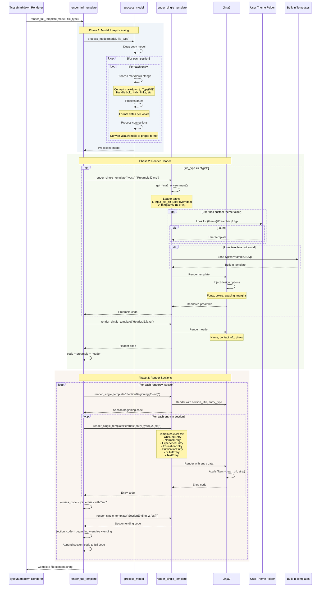

### 7. Watch Mode (File Watcher)

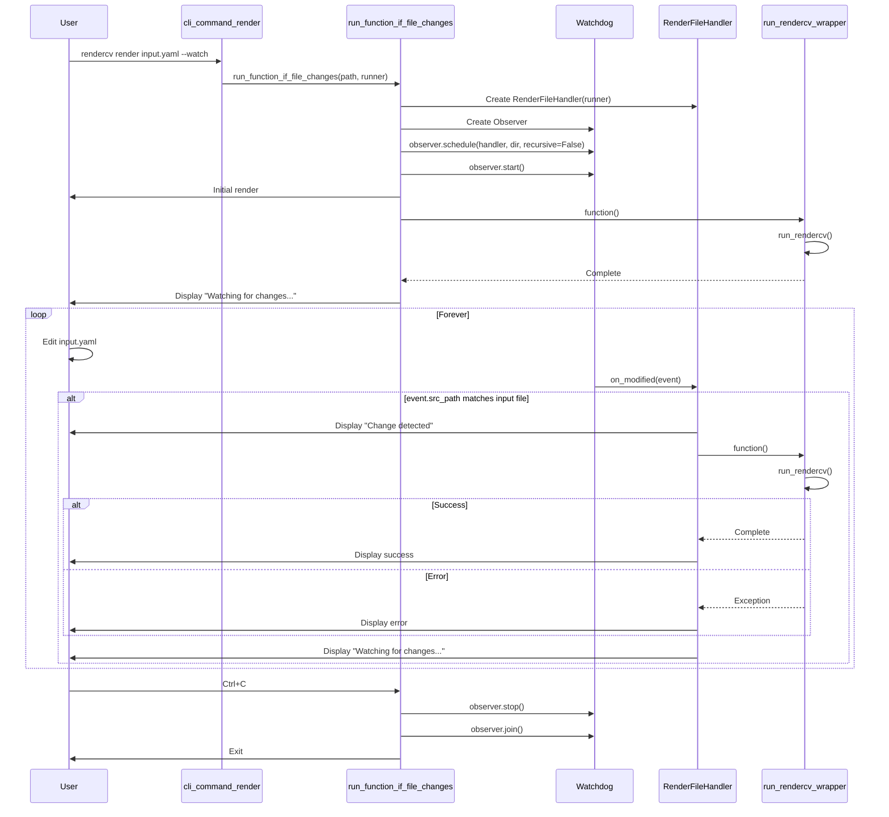

## Key Components Deep Dive

### 1. Exception Hierarchy

```python
# src/rendercv/exception.py

RenderCVValidationError (TypedDict)
├─ location: tuple[str, ...]           # e.g., ('cv', 'sections', 'education', '0', 'degree')
├─ yaml_location: ((start_line, start_col), (end_line, end_col))
├─ message: str                        # User-friendly error message
└─ input: str                         # The invalid value

RenderCVUserError (ValueError)
└─ message: str | None                # For user-facing errors

RenderCVUserValidationError (ValueError)
└─ validation_errors: list[RenderCVValidationError]  # Collection of validation errors

RenderCVInternalError (RuntimeError)
└─ message: str                       # For unexpected internal errors
```

### 2. Data Model Structure

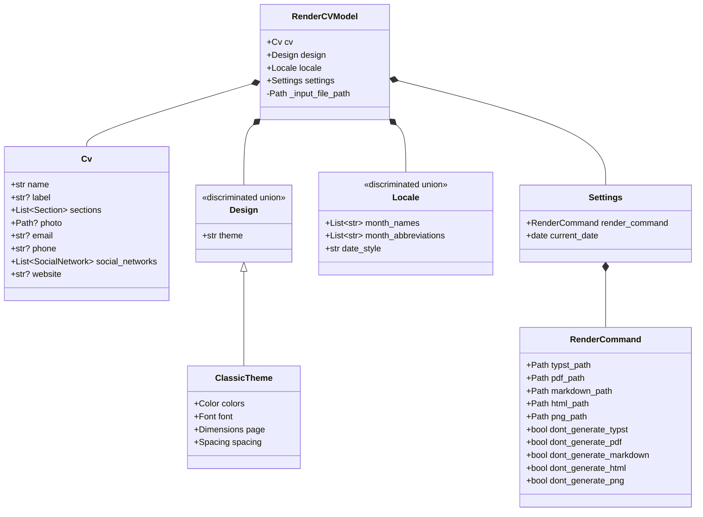

### 3. CLI Command Registration System

The application uses a dynamic command discovery system:

```python
# src/rendercv/cli/app.py

# At module load time:
cli_folder_path = pathlib.Path(__file__).parent
for file in cli_folder_path.rglob("*_command.py"):
    folder_name = file.parent.name    # e.g., "render_command"
    py_file_name = file.stem          # e.g., "render_command"
    full_module = f"{__package__}.{folder_name}.{py_file_name}"
    module = importlib.import_module(full_module)
```

This ensures:
- New commands are automatically discovered
- Command structure is enforced: `./name_command/name_command.py`
- Commands register themselves via `@app.command()` decorator

### 4. Timed Step System

The rendering progress uses a clever timing wrapper:

```python
def timed_step[T, **P](
    message: str,
    progress: RenderProgress,
    live: rich.live.Live,
    func: Callable[P, T],
    *args: P.args,
    **kwargs: P.kwargs,
) -> T:
    start = time.perf_counter()
    result = func(*args, **kwargs)
    end = time.perf_counter()
    timing_ms = f"{(end - start) * 1000:.0f}"

    # Automatically pluralize based on result type
    paths: list[pathlib.Path] = []
    if isinstance(result, pathlib.Path):
        paths = [result]
    elif isinstance(result, list) and result:
        if len(result) > 1:
            message = f"{message}s"  # "Generated PNG" → "Generated PNGs"
        paths = result

    progress.completed_steps.append(CompletedStep(timing_ms, message, paths))
    live.update(progress.build_panel())
    return result
```

This provides:
- Automatic timing for each step
- Live progress updates
- Automatic pluralization for multi-file outputs
- Path display relative to CWD

### 5. Override System

The override system allows CLI arguments to modify nested dictionary values:

```python
# Example usage:
# rendercv render input.yaml --cv.sections.education.0.institution "MIT"

def update_value_by_location(dict_or_list, key, value, full_key):
    keys = key.split(".")  # ["cv", "sections", "education", "0", "institution"]
    first_key = keys[0]
    remaining_key = ".".join(keys[1:])

    if isinstance(dict_or_list, list):
        first_key = int(first_key)  # Convert to index

    if len(keys) == 1:
        dict_or_list[first_key] = value  # Base case
    else:
        # Recursive case
        dict_or_list[first_key] = update_value_by_location(
            dict_or_list[first_key],
            remaining_key,
            value,
            full_key
        )

    return dict_or_list
```

### 6. Path Resolution System

Output paths support placeholder substitution:

```python
# src/rendercv/renderer/path_resolver.py

file_path_placeholders = {
    "MONTH_NAME": "December",
    "MONTH_ABBREVIATION": "Dec",
    "MONTH": "12",
    "MONTH_IN_TWO_DIGITS": "12",
    "YEAR": "2025",
    "YEAR_IN_TWO_DIGITS": "25",
    "NAME": "John Doe",
    "NAME_IN_SNAKE_CASE": "John_Doe",
    "NAME_IN_LOWER_SNAKE_CASE": "john_doe",
    "NAME_IN_UPPER_SNAKE_CASE": "JOHN_DOE",
    "NAME_IN_KEBAB_CASE": "John-Doe",
    "NAME_IN_LOWER_KEBAB_CASE": "john-doe",
    "NAME_IN_UPPER_KEBAB_CASE": "JOHN-DOE",
}

# Example path: "output/NAME_IN_LOWER_SNAKE_CASE_CV_YEAR.pdf"
# Resolves to: "output/john_doe_CV_2025.pdf"
```

### 7. Typst Compiler Integration

```python
# src/rendercv/renderer/pdf_png.py

@functools.lru_cache(maxsize=1)
def get_typst_compiler(
    file_path: pathlib.Path,
    input_file_path: pathlib.Path | None,
) -> typst.Compiler:
    return typst.Compiler(
        file_path,
        font_paths=[
            *rendercv_fonts.paths_to_font_folders,  # Package fonts
            (
                input_file_path.parent / "fonts"     # User custom fonts
                if input_file_path
                else pathlib.Path.cwd() / "fonts"
            ),
        ],
    )
```

Key points:
- Compiler is cached (LRU with maxsize=1)
- Supports custom fonts from `fonts/` folder next to input file
- Photos must be copied next to Typst file for compilation
- Single compiler instance generates both PDF and PNG

### 8. Error Handling Decorator

```python
# src/rendercv/cli/error_handler.py

def handle_user_errors[T, **P](function: Callable[P, None]) -> Callable[P, None]:
    @functools.wraps(function)
    def wrapper(*args: P.args, **kwargs: P.kwargs) -> None:
        try:
            return function(*args, **kwargs)
        except RenderCVUserError as e:
            if e.message:
                print(f"[bold red]{e.message}[/bold red]")
            typer.Exit(code=1)
    return wrapper
```

All CLI commands are wrapped with `@handle_user_errors` to:
- Catch user-facing errors
- Display friendly error messages
- Exit with proper exit codes
- Prevent stack traces for expected errors

## Error Handling System

### Error Flow Diagram

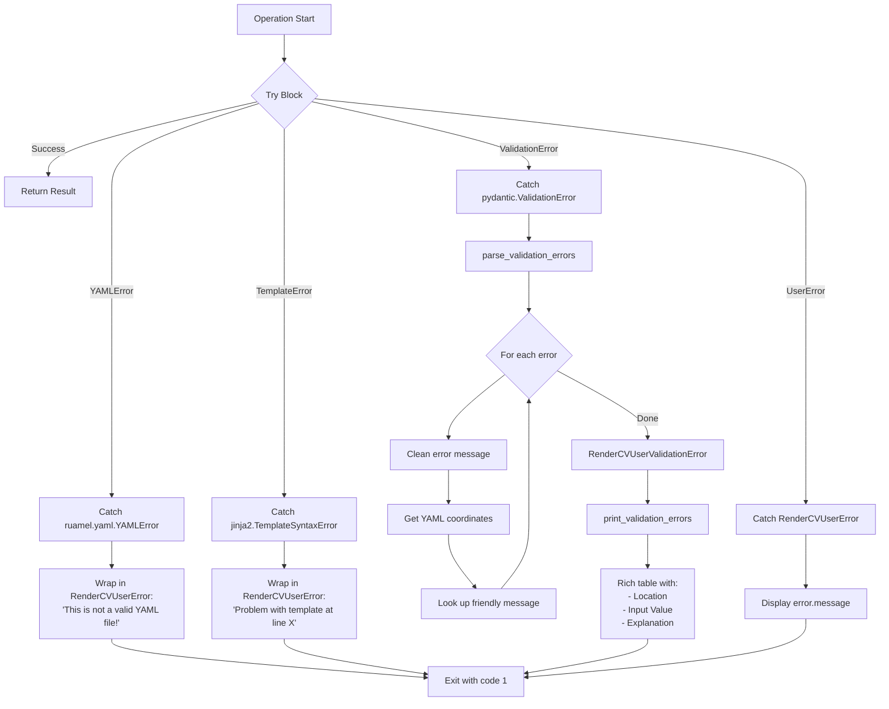

### Validation Error Table Example

When validation fails, users see:

```
There are errors in the input file!

┌─────────────────────────┬─────────────┬──────────────────────────────────────┐
│ Location                │ Input Value │ Explanation                          │
├─────────────────────────┼─────────────┼──────────────────────────────────────┤
│ cv.sections.education.  │ 2025-13-01  │ This is not a valid date! Please use │
│ 0.start_date            │             │ YYYY-MM-DD, YYYY-MM, or YYYY format. │
├─────────────────────────┼─────────────┼──────────────────────────────────────┤
│ cv.phone                │ invalid     │ This is not a valid phone number.    │
└─────────────────────────┴─────────────┴──────────────────────────────────────┘
```

Each error includes:
- Exact location in dotted notation
- The invalid input value
- User-friendly explanation from `error_dictionary.yaml`
- YAML line/column numbers (used internally for highlighting)

## Data Flow

### Complete Data Transformation Pipeline

```mermaid
graph LR
    subgraph Input
        YAML[YAML File]
        DESIGN[Design YAML]
        LOCALE[Locale YAML]
        SETTINGS[Settings YAML]
        OVERRIDE[CLI Overrides]
    end

    subgraph "Parsing Layer"
        READER[yaml_reader]
        COMMENTED[CommentedMap<br/>with lc.data]
    end

    subgraph "Transformation Layer"
        MERGE[Merge Overlays]
        APPLY[Apply Overrides]
        DICT[Final Dictionary]
    end

    subgraph "Validation Layer"
        PYDANTIC[Pydantic Validation]
        MODEL[RenderCVModel]
        ERROR[Validation Errors]
    end

    subgraph "Processing Layer"
        PROCESS[Model Processing]
        MARKDOWN_PARSE[Markdown Parsing]
        DATE_FORMAT[Date Formatting]
        CONNECTIONS[Connection Processing]
    end

    subgraph "Template Layer"
        JINJA[Jinja2 Environment]
        USER_TEMPLATES[User Templates]
        BUILTIN_TEMPLATES[Built-in Templates]
    end

    subgraph "Rendering Layer"
        TYPST_OUT[Typst Code]
        MD_OUT[Markdown]
    end

    subgraph "Compilation Layer"
        TYPST_COMPILER[Typst Compiler]
        MD_PARSER[Markdown Parser]
        PDF[PDF]
        PNG[PNG]
        HTML_OUT[HTML]
    end

    YAML --> READER
    DESIGN --> READER
    LOCALE --> READER
    SETTINGS --> READER

    READER --> COMMENTED
    COMMENTED --> MERGE

    MERGE --> APPLY
    OVERRIDE --> APPLY
    APPLY --> DICT

    DICT --> PYDANTIC
    PYDANTIC -->|Valid| MODEL
    PYDANTIC -->|Invalid| ERROR
    ERROR --> ERROR_DISPLAY[Error Table]

    MODEL --> PROCESS
    PROCESS --> MARKDOWN_PARSE
    PROCESS --> DATE_FORMAT
    PROCESS --> CONNECTIONS

    CONNECTIONS --> JINJA
    JINJA --> USER_TEMPLATES
    JINJA --> BUILTIN_TEMPLATES

    USER_TEMPLATES --> TYPST_OUT
    BUILTIN_TEMPLATES --> TYPST_OUT
    USER_TEMPLATES --> MD_OUT
    BUILTIN_TEMPLATES --> MD_OUT

    TYPST_OUT --> TYPST_COMPILER
    TYPST_COMPILER --> PDF
    TYPST_COMPILER --> PNG

    MD_OUT --> MD_PARSER
    MD_PARSER --> HTML_OUT
```

### File Dependencies

```mermaid
graph TB
    INPUT[Input YAML]

    INPUT --> TYPST[Typst File]
    INPUT -.->|Optional| PHOTO[Photo File]
    INPUT -.->|Optional| USER_TYPST[User Typst Templates]
    INPUT -.->|Optional| USER_MD[User Markdown Templates]
    INPUT -.->|Optional| FONTS[Custom Fonts Folder]

    TYPST --> PDF[PDF File]
    TYPST --> PNG[PNG Files]

    INPUT --> MD[Markdown File]
    MD --> HTML[HTML File]

    PHOTO -.->|Copied to| TYPST_DIR[Typst Directory]
    TYPST_DIR --> PDF
    TYPST_DIR --> PNG

    USER_TYPST -.->|Override| TYPST
    USER_MD -.->|Override| MD

    FONTS -.->|Used by| PDF
    FONTS -.->|Used by| PNG

    style INPUT fill:#e1f5ff
    style TYPST fill:#ffe1e1
    style MD fill:#e1ffe1
    style PDF fill:#ffe1f5
    style PNG fill:#f5e1ff
    style HTML fill:#ffffе1
    style PHOTO stroke-dasharray: 5 5
    style USER_TYPST stroke-dasharray: 5 5
    style USER_MD stroke-dasharray: 5 5
    style FONTS stroke-dasharray: 5 5
```

## Key Design Patterns

### 1. Discriminated Union Pattern

Used for `Design` and `Locale` to support multiple themes/locales:

```python
class Design(BaseModel):
    theme: str  # Discriminator field

# Pydantic automatically routes to correct subclass based on theme value:
# - theme: "classic" → ClassicTheme
# - theme: "engineeringresumes" → EngineeringResumesTheme
# - theme: "mycustomtheme" → Dynamically imported from mycustomtheme/__init__.py
```

### 2. Factory Pattern

Default instances are created via `default_factory`:

```python
class RenderCVModel(BaseModel):
    design: Design = pydantic.Field(default_factory=ClassicTheme)
    locale: Locale = pydantic.Field(default_factory=EnglishLocale)
    settings: Settings = pydantic.Field(default_factory=Settings)
```

### 3. Observer Pattern

File watching uses the Observer pattern via `watchdog`:

```python
observer = Observer()
handler = RenderFileHandler(function)
observer.schedule(handler, directory, recursive=False)
observer.start()
```

### 4. Template Method Pattern

Rendering follows a template method:
1. Process model (pre-processing hook)
2. Render preamble (optional for Typst)
3. Render header
4. Render sections (loop)
5. Return complete code

### 5. Decorator Pattern

- `@handle_user_errors` wraps CLI commands
- `@functools.lru_cache` caches Jinja2 environment and Typst compiler
- `@pydantic.model_validator` for post-validation processing

### 6. Strategy Pattern

Different rendering strategies for different file types:
- Typst rendering strategy (preamble + header + sections)
- Markdown rendering strategy (header + sections, no preamble)
- HTML rendering strategy (convert MD to HTML + wrap in template)

## Testing Considerations

When adding new features or fixing bugs, consider:

### Unit Testing Areas
1. **YAML Reading**: Test `read_yaml` with various file types and edge cases
2. **Override System**: Test `update_value_by_location` with nested structures
3. **Path Resolution**: Test placeholder substitution
4. **Error Parsing**: Test `parse_validation_errors` with different Pydantic errors
5. **Model Processing**: Test markdown parsing, date formatting, connection processing

### Integration Testing Areas
1. **Full Render Pipeline**: Input YAML → All output formats
2. **Watch Mode**: File change detection and re-rendering
3. **Custom Themes**: User templates override built-in templates
4. **CLI Overrides**: Command-line arguments properly modify model
5. **Error Handling**: Each exception type displays correctly

### End-to-End Testing Areas
1. **New Command**: Full workflow from `rendercv new` to `rendercv render`
2. **Create Theme**: Theme creation and usage
3. **Multiple Formats**: All formats generated correctly from same input
4. **Validation Errors**: Error messages match YAML locations

## Common Development Workflows

### Adding a New CLI Command

1. Create folder: `src/rendercv/cli/mycommand_command/`
2. Create file: `src/rendercv/cli/mycommand_command/mycommand_command.py`
3. Import and decorate:
```python
from ..app import app
from ..error_handler import handle_user_errors

@app.command(name="mycommand")
@handle_user_errors
def cli_command_mycommand(...):
    pass
```
4. Command automatically registered at startup

### Adding a New Theme

1. Create folder: `src/rendercv/schema/models/design/mytheme/`
2. Create `__init__.py` with Pydantic model
3. Create Typst templates in `src/rendercv/renderer/templater/templates/mytheme/`
4. Add to `available_themes` list

### Adding a New Entry Type

1. Add entry class to `src/rendercv/schema/models/cv/entry.py`
2. Create template: `src/rendercv/renderer/templater/templates/typst/entries/MyEntry.j2.typ`
3. Create template: `src/rendercv/renderer/templater/templates/markdown/entries/MyEntry.j2.md`
4. Add to `Entry` discriminated union

### Debugging Validation Errors

1. Check `src/rendercv/schema/error_dictionary.yaml` for message mapping
2. Look at `parse_plain_pydantic_error` for error processing logic
3. Use CommentedMap's `lc.data` to trace YAML locations
4. Test with minimal YAML examples

## Performance Considerations

### Caching Strategy

1. **Jinja2 Environment**: Cached with `@lru_cache(maxsize=1)`
   - Reused across all template renders in a session
   - Invalidated only when input file path changes

2. **Typst Compiler**: Cached with `@lru_cache(maxsize=1)`
   - Single compiler instance for both PDF and PNG
   - Includes font paths from package and user folders

### Optimization Opportunities

1. **Parallel Rendering**: PDF and PNG could be generated in parallel
2. **Incremental Compilation**: Watch mode re-renders everything; could track changes
3. **Template Pre-compilation**: Jinja2 templates could be pre-compiled
4. **Font Loading**: Typst compiler loads fonts each time; could be cached

## Conclusion

RenderCV is a well-architected application with clear separation of concerns:

- **CLI Layer**: Typer-based command interface with automatic discovery
- **Orchestration Layer**: Command handlers with error decoration
- **Data Layer**: YAML reading, validation, and model building
- **Processing Layer**: Model transformation and pre-processing
- **Rendering Layer**: Template-based multi-format output
- **Compilation Layer**: Typst and Markdown compilation

Key strengths:
- Type-safe validation with excellent error reporting
- Flexible override system for customization
- Clean template system for theming
- Real-time progress feedback
- Watch mode for iterative development

Areas for potential enhancement:
- Parallel rendering of formats
- Incremental compilation in watch mode
- Plugin system for custom entry types
- More caching opportunities
